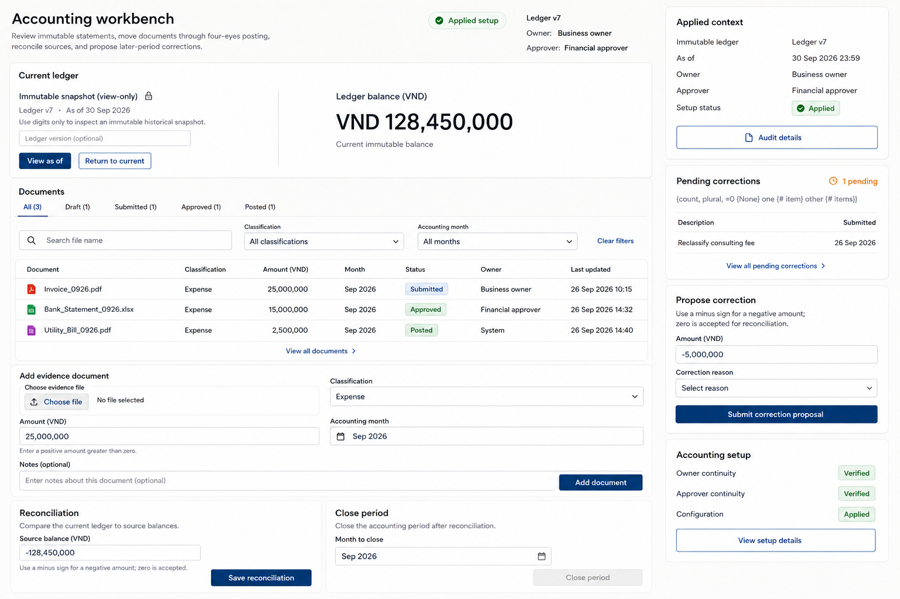

# document-filter-response-001

Status: `done`.

The filter row sits immediately below the existing status tabs, making file-name, classification, and accounting-month refinement discoverable without creating a competing workflow. The row reuses the baseline's native control styling and dark-blue interaction color, while the existing tabs continue to filter status. The ledger stays visibly locked and view-only, and all unrelated panels remain present. Pixel review found the requested labels readable and the 1536 x 1024 composition coherent. The ICU-style plural literal under Pending corrections is inherited from the baseline rather than introduced by this direction. Interaction behavior remains a later native-implementation requirement.

The adjacent PNG is an exact preview copy. Original artifact paths and hashes remain in the JSON record.
