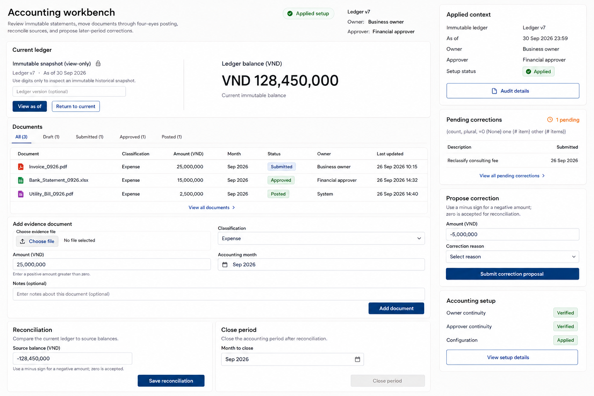

# response-recovery-immutable-ledger-002

Status: `done`.

This correction supersedes prior response response-recovery-immutable-ledger-001, which was rejected because the controlled fault-injection candidate exposed an editable numeric balance and direct Save balance action while still calling the snapshot view-only. The corrected pixels restore VND 128,450,000 as static heading text, restore Current immutable balance, preserve the lock beside Immutable snapshot (view-only), and remove the number-input spinner and Save balance control. Visual inspection found the documents, evidence intake, reconciliation, close-period area, applied context, pending corrections, correction proposal, and accounting setup consistent with the original selected baseline. This is a design artifact review, not evidence of autonomous operator execution or working frontend behavior.

The adjacent PNG is an exact preview copy. Original artifact paths and hashes remain in the JSON record.
