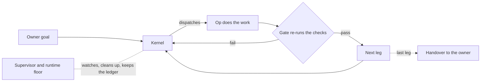

# StarCi

AI agents write code fast and check it badly. StarCi makes every step pass a gate before the next one starts.

[](https://github.com/starci183/starci-skills/actions/workflows/ci.yml)
[](https://sonarcloud.io/summary/new_code?id=starci183_starci-skills)
[](https://sonarcloud.io/summary/new_code?id=starci183_starci-skills)
[](https://sonarcloud.io/summary/new_code?id=starci183_starci-skills)
[](https://codecov.io/gh/starci183/starci-skills)
[](https://github.com/starci183/starci-skills/releases)
[](LICENSE)



## Overview

**Why StarCi.** A coding agent that grades its own work will usually pass itself. StarCi removes that:
the agent that makes a piece of work never judges it. A separate check, run by the runtime, decides
whether the work is accepted, and the next step cannot start until it is. Everything that happens is
written to a ledger (a SQLite database kept outside your repositories), so a workflow survives a
restart, a closed chat or a dead agent.

You hand StarCi a software goal. It plans the work as a chain of small jobs, gives each job to an
AI agent, checks the result, and hands the finished work back to you.

**Terms.** A *workflow* is one goal and its chain of jobs. An *op* is one short-lived agent that does one job.
A *gate* is a check the runtime re-runs itself before it accepts an op's result. A *seat* is a long-lived
agent session. A *lane* is a separate git worktree where one workflow works, so workflows do not collide.

**How it works.** Five roles stand on one floor. The floor is the runtime itself: it detects, counts, retries
within bounds, cleans up and runs the checks. Agents are used only where judgment is needed.
Reports go up one level at a time, and instructions go down one level at a time.

| Role | Scope | Job |
| --- | --- | --- |
| Op | one unit of work | Does one job under its contract and reports with evidence. Never grades itself. |
| Critic | one product of one op | Grades that product independently, from a different provider than the maker. |
| Kernel | one workflow | Dispatches ops by the plan, settles their reports by re-running the checks, decides retry or re-plan. |
| Supervisor | all workflows on the machine | Rules on gates, resolves conflicts between workflows, divides shared resources. |
| Debug | the owner's chat, for a limited stabilisation period | Audits whether each role did its job and fixes the runtime when one did not. |

The owner decides what only a person can: intent, credentials, spend and irreversible choices.
The reporting chain is Op to Kernel to Supervisor to owner. The full contract is `modules/kernel/roles.yaml`.

One workflow, step by step:

1. You describe a goal in a chat with the `/starci` entry. StarCi assesses it and shows the plan.
2. You approve the exact goal and plan. Only then is the job chain written to the ledger.
3. You start the workflow. The runtime boots one Kernel for it.
4. The Kernel dispatches ops one job at a time. Each op works in its own worktree.
5. When an op reports, a gate re-runs the checks and accepts or rejects the result. A rejected job is retried or re-planned.
6. When every leg has passed, the work is handed over to you with its evidence.

## Stack

- Node.js `^22.22.3 || ^24.15.0` (`package.json` `engines.node`) with unflagged `node:sqlite`. The runtime ships sources only and needs no dependency install.
- An agent host that can run `/starci`, and Orca, the only place the runtime launches agents. The agent CLIs StarCi can drive are Claude Code, Codex and Devin; StarCi has no API key of its own.
- `age-keygen` on `PATH` for the install's secret setup (`docs/installation.md`).
- Platforms: the host services are developed and used on Windows (Task Scheduler). CI builds and tests on Linux. macOS and Linux host startup is not yet proven (`docs/host-contract.md`).

## Quick start

Install the CLI once, then install the runtime into the directory that will own `.claude/`:

```sh
starci runtime install --cwd <host>
starci runtime doctor --cwd <host> --quick
```

Without a global install, run `npx @starci/cli` in place of `starci`. `docs/installation.md` has the details,
including what the installer writes and how to update.

Check the host, then define and start a workflow. The normal route is a chat that selects `/starci`; the
commands below are what it runs:

```sh
starci reconciler up --check --brief
starci workflow define --repo <project-repo> --text "Add a login page"
starci workflow start --repo <project-repo>
starci workflow status --workflow <id>
```

If something looks stuck, print the read-only digest of every running workflow:

```sh
starci debug digest
```

## Configuration

`config.yaml` is local to the host and is seeded from `config.example.yaml` at install. It is never committed.
The keys an owner meets first:

- `language`: the language of the owner-facing text.
- `model` and `effort`: the model and effort agents use when nothing more specific is routed.
- `kernel.effort`: the effort of Kernel agents.
- `budgets.maxOps`: how many ops one workflow may hold open at once.
- `launchTrust`: the repository roots on which unattended agent launches are allowed.

Every key and its allowed values are in [docs/config-format.md](docs/config-format.md).

## Project status

StarCi is on the alpha line `1.0.0-alpha.N`; the current source is `1.0.0-alpha.7`. Contracts are provisional.
`1.0.0` means the two real workflows run smoothly from the goal to the handover, and then the contracts freeze.
Today both stop at a design gate (`brand.decide`), and the cost of a decision leg is not yet measured against
its budget. [CHANGELOG.md](CHANGELOG.md) lists what changed in each release and its "Known limitations".
The target state is [docs/goal.md](docs/goal.md).

## Repository layout

```text
modules/     contracts as data: roles, goal, kernel, ops, models, host, CLI verbs
engine/      shared mechanisms: the ledger databases, config, constants
scripts/     the runtime code: Kernel verbs, reconciler, supervisor, checks, gates
packages/    the CLI and the published toolkits
knowledge/   authored rules the checks and skills cite
skills/      the one public /starci entry
docs/        human documentation
examples/    reference products
tests/       the specs
```

## Development

Run `starci npm ci` once. The local gates:

- `starci runtime check` runs every self-check, including the Sonar rules enforced locally.
- `starci check run --level L1 --changed <files>` runs the fast gates on the files you changed.
- `starci test run --level L1 --spec <files>` runs the specs that cover them.
- The pre-commit hook runs the Sonar-rules gate on the staged files.

Nothing is pushed between releases. A release is cut with `starci release cut`, which pushes `main` and an
annotated tag together, and CI then runs on the tag. See [CONTRIBUTING.md](CONTRIBUTING.md) and
[docs/releasing.md](docs/releasing.md).

## Documentation

- [Installation](docs/installation.md) and [CLI reference](docs/cli.md)
- [Architecture](docs/architecture.md), [the Kernel](docs/workflow-kernel.md), [the Supervisor](docs/supervisor.md)
- [Writing an op](docs/ops.md) and [host contracts](docs/host-contract.md)
- [Debugging](docs/debugging.md) and [storage](docs/ledger-db.md)
- [Releasing](docs/releasing.md) and [the target state](docs/goal.md)

Agent-facing instructions live in [CONTEXT.md](CONTEXT.md).

## License

MIT, see [LICENSE](LICENSE). `engine/yaml.mjs` is a vendored bundle of the `yaml` package; see
[THIRD_PARTY_NOTICES.md](THIRD_PARTY_NOTICES.md).
