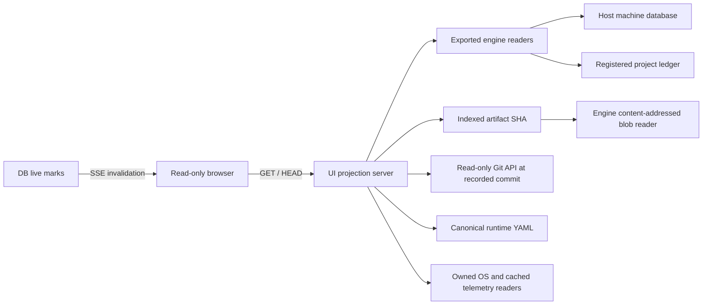

# StarCi public status UI contract

The StarCi runtime is a control plane. The owner defines a Goal; one long-lived Kernel seat steers each Workflow; an ephemeral Op agent runs one job and reports; checks and the settler determine the verdict; the reconciler's seven controllers maintain mechanical progress; the Supervisor makes worker-wide decisions. The public UI observes these records and never performs their transitions.

The engine owns the supported project-ledger and host-machine schema versions. The runtime source is `.claude`; the machine database path is resolved by `engine/db/machine.mjs` (normally `%LOCALAPPDATA%/StarCi/machine.sqlite`). Project ledger paths are resolved only through `machine.ledgers`. The UI opens both through the exported read-only engine readers and exposes actual schema versions through `/api/contract`. This contract owns projection identity, historical evidence, clocks, availability and completeness.

## 0. Concept trace

| Concept | Question answered | UI location | Read API | Source |
| --- | --- | --- | --- | --- |
| C1 Goal | What was approved and which revision? | Workflow goal | `/api/workflows/:p/:wf` | `goals`, `goal_inputs` |
| C2 Workflow | Is it progressing; why; when will it finish? | Overview rows, Workflow header | `/api/workers`, `/api/workflows*` | `workflows`, `v_workflow_progress`, `lifecycle_changes`, `metrics_snapshots` |
| C3 Seat | Is its Kernel or Supervisor present? | Workflow seat, System Services | `/api/seats` | `v_seats`, `v_deaf_seats`, `seat_turns` |
| C4 Work graph | What is ready and what blocks it? | Workflow graph, units and inspector | `/api/workflows/:p/:wf/graph`, `/units*` | `v_units`, `unit_edges`, `v_blocking` |
| C5 Kernel decision | What did the Kernel decide; did it work? | Workflow Decisions and Why | `/api/decisions/log`, `/rca` | `decisions`, `metrics_snapshots` |
| C6 Dispatch | Who was routed and admitted, and why? | Attempt route step | `/api/attempts/:p/:id` | `op_attempts`, `throttle_decisions` |
| C7 Attempt | What is the Op doing right now? | Attempt timeline and transcript | `/api/attempts*`, `/transcript*` | `v_op_history`, `attempt_transcript_snapshots`, `blobs` |
| C8 Report | What did the Op claim? | Attempt report | `/api/attempts/:p/:id` | `reports`, `report_attachments` |
| C9 Checks | Which checks proved or rejected it? | Attempt checks | `/checks/:id`, `/api/blob/:sha` | `v_checks`, `blobs` |
| C10 Verdict | What did the settler decide? | Attempt verdict and retry | `/api/attempts/:p/:id` | `op_attempts`, `jobs`, `decisions` |
| C11 Checkpoint / Integration | Was a runtime checkpoint recorded; has the workflow or runtime change integrated? | Attempt result and workflow integration, System runtime integration | Attempt detail, `/api/land*`, `/api/lanes` | Scoped workflow checkpoint/integration events, historical `product_lands`, runtime `land_queue/land_runs`; push has its own receipt |
| C12 Decision Item | Who must decide; when; has it escalated? | Overview attention, Decisions, Workflow | `/api/decisions*`, `/api/asks`, `/api/incidents` | `v_decision_rows`, `sup_decision_items`, `ask_requests`, `incidents` |
| C13 Reconciler | Which invariant or controller changed state? | Overview health, System Engine/SLA | `/api/health`, `/api/reconciler*`, `/api/sla/*` | `v_engine_health`, `engine_queue`, `v_engine_actions`, `v_sla_open` |
| C14 Resources | Why was work throttled? | System Resources | `/api/resources*`, `/api/terminals` | `throttle_state`, `provider_health`, `quotas`, `host_leases` |
| C15 Cleanup | What is leaking or awaiting GC? | System Cleanup, Workflow Infra | `/api/gc/*`, `/api/leaks`, `/worktrees` | `gc_runs`, `gc_items`, `v_leaks`, `v_ledger_leaks` |
| C16 Learning | Which lesson or ruling changed policy? | System Learning, Attempt related lessons | `/api/supervisor/lessons`, `/rulings`, `/api/metrics/ops` | `sup_learning`, `sup_owner_rulings`, `v_model_scorecard` |
| C17 Observation | What happened in order, with source proof? | Logs, Workflow timeline, Attempt transcript | `/api/logs*`, `/api/timeline`, `/api/live` | `logs`, `machine_logs`, `events`, `v_timeline` |
| Identity | Where is this ID? | Global search | `/api/search` | `v_search_ids`, log FTS |

The Work DAG groups units only when their operation and predecessor set match. A group displays ×N and opens individual units; edges keep their actual kind (`after`, `seam`, `dependsOn`, `peer-wait`). A grouped node is a visual summary, never a replacement for stored unit identity.

An ended workflow (`phase` `archived`|`finished`) contributes no live row to `v_decision_rows`, `v_blocking` or `v_open_work` and no live `decision_items` count — its resolved Decision Items stay listed as history.

## 1. HTTP API and source map

Every JSON success has `{data,meta:{at,etag,sources,stale,next}}`, with additive source availability/scope when supplied. `meta.at` dates response assembly; recorded source times and client revalidation times retain their separate meanings in [Time, availability and completeness](#4-time-availability-and-completeness). The public read API has no request-rate limit (owner ruling 2026-09-29). Error responses have `{error:{code,message}}`. List cursors are opaque. All API routes accept GET and HEAD only; other methods return 405. The SPA and API share one server, default port `statusApp.port` of `modules/models/runtimes.yaml`. A single `/api/live` SSE channel invalidates selected queries; `/api/logs/stream` emits filtered log rows. Conditional JSON reads use ETag/304. Static assets do not consume the API rate budget.

### Read transport and authority

The browser does not open SQL, filesystem paths or provider APIs. API GET/HEAD handlers use
exported read-only engine handles and canonical views. Bounded SQL filters, joins, pagination
and display arithmetic are valid projections; admission, retry, readiness, settlement and
eligibility rules remain with their runtime owners. No UI handler calls a workflow lifecycle
command, a verifier, a provider probe or a writer. Kernel `status` is unsuitable as a UI reader
because it also sweeps waits and renews worker leases.

Machine registration resolves `ledgerId → file`. A repository path is not a ledger locator.
Schema compatibility belongs to the engine opener; UI reads do not migrate or bypass verification.
Deployment must bind a reviewed runtime revision containing the machine reader's supported
schema versions. Machine reads use `openMachineObserver`: bounded corruption retry and
recovery retain in-memory diagnostics without incident or outbox writes. The operational
machine reader has separate diagnostic effects. Source availability records opening and
statement failures for the current API request; a later request observes recovery independently.

Artifact index rows establish `(ledger, artifactId, attemptId, SHA)`. Blob reads use engine
`blobPath/statBlob/getBlob`; they do not crawl folders or restore archived bytes. Git product
reads validate repository, recorded commit and relative path through the read-only Git owner.
Current checkout content cannot stand in for historical evidence. YAML describes the current
operation/configuration unless a dispatch explicitly captured its revision.

### Page and source matrix

| Surface | API | Canonical source and reader | Scope / proof limit |
| --- | --- | --- | --- |
| Shell and vocabulary | `/healthz`, `/api/contract` | Machine registry, schema versions, ledger metadata and vocabulary views; engine openers | Read availability is separate from engine readiness. Preserve ledger UUID and display name. |
| Search | `/api/search` | Machine/project `v_search_ids`, scoped owning views and log FTS | Resolve native kind/ID to a supported target; keep matched identity and target identity separate. |
| Overview | `/api/workers`, `/projects`, `/workflows`, `/health` | Workflow/unit/DI views, machine seats/SLA and recorded metric snapshots; `workflowStateOf` | Host totals and project-filtered cards have explicit different scopes. Partial ledgers do not imply zero activity. |
| Workflow header | `/api/workflows/:p/:wf` | Workflow lifecycle, recorded goal revision/approval, progress, seat and blockers | Workflow-wide history counts are not completion proof for the latest goal. |
| Op plan DAG | `/api/workflows/:p/:wf/pipeline` | Recorded `goals.json.opChain`, exact leg labels and edges | Approval and goal revision must be explicit. Base operation history cannot establish repeated-instance completion. |
| Unit DAG / inspector | `/graph`, `/units`, `/units/:unit` | `v_units`, `unit_edges`, scoped attempts/decisions/blockers | Identity is workflow + unit. Retain edge kind and goal revision. |
| Work scope DAG | `/pipeline` | `latestVersion`, `versionsOf`, `liveColors` from the canonical WorkGraph store | Coverage color is not Unit/Attempt verdict or direct identity binding. Preserve version/digest/author/time. |
| Attempt Gantt | `/api/attempts`, `/pipeline` | Numeric dispatch records and recorded timestamps | Dispatch, start/attestation, terminal close, report, settle and release are different milestones. |
| Workflow Why / Evidence | `/rca`, `/coverage`, `/verify` | Recorded `metrics_snapshots`; blob-backed payload through engine reader | Decode producer shape and preserve snapshot ID/time/window/subject. Missing snapshot is unknown. GET does not rerun the producer. |
| Workflow Infra | `/worktrees`, `/api/leaks` | Machine worktree registry and ledger leak views | Stored paths do not prove current process liveness. Use recorded attempt association where present. |
| Attempt header / result | `/api/attempts/:p/:id` | Attempt, immutable report row, dispatch contract, checks and stored settlement; `whyOf/kernelNotesOf` | Requested model, attested model, Op claim and runtime verdict remain independent. Stored and computed explanations have different provenance. |
| Attempt Inputs / Where | Attempt detail | Dispatch-keyed contract packet and captured subtrees; attempt checkout columns | Current mutable job payload is a separately labelled reference. Do not rebuild old dispatch scope from it. |
| Attempt checks | Detail, `/checks/:id` | Canonical check-run selection, raw `check_runs/v_checks`, output SHA | Logical identity includes runner/authority, phase and name. Manifest assertions are separate self-declared criteria. |
| Attempt Products | `/products` | Runtime checkpoint receipt where available; recorded report-tested head; read-only Git API | Show head source. A report file declaration does not alone prove the file entered a runtime checkpoint. |
| Attempt Diff | `/diff` | Attempt-bound patch artifact and indexed assets | Compare patch base/head to displayed provenance. Do not use live checkout diff. |
| Attempt transcript | `/transcript`, `/transcript/snapshots` | Final SHA or exact attempt/snapshot pair, indexed blobs | Evidence time is recorded time; response time is not a missing snapshot timestamp. Job logs may span several dispatches. |
| Checkpoint / workflow integration | Attempt detail | Bounded recorded checkpoint and workflow-land events; historical product receipts | Checkpoint is independent. Workflow integration is workflow/repository scoped; exact head match is explicit association, not inferred ancestry. |
| Decisions / Asks / Incidents | `/api/decisions*`, `/asks`, `/incidents` | Owning DI views, recorded resolutions/events/deliveries, ask and incident rows | Namespaces include machine/ledger. Credential text stays suppressed. Options are read-only text. |
| System Engine | `/reconciler*`, `/queue`, `/health` | Engine health/starts/leader/controller/action views; canonical crash-loop policy | Raw start counts differ from policy evaluation. Warning/unknown states cannot become healthy by omission. |
| System SLA | `/sla/*` | Recorded episodes/violations and canonical `slaCatalog` resolver | Historical episode deadlines retain recorded `sla_ms`; current catalog is reference metadata. |
| System Resources / admission | `/resources*` | Exported throttle/provider/quota/lease/budget/sample readers; canonical reservation readers when supported | Captured quota and occupied slots do not grant present launch permission. Released receipt history is separate from active holds. |
| Host telemetry | `/api/host` | Current Node OS values, owned cached CIM/GPU/disk readers and recorded `host_samples` | Preserve each probe's actual observation time, cache age and failure; one response clock does not date all sensors. |
| System Services | `/services*`, `/seats`, `/terminals` | Owning service/seat/probe/terminal views and reader methods | Recorded probes do not imply a new live probe; shell-terminal inventory is not all agents. |
| System Cleanup | `/gc/*`, `/leaks` | GC records/items, indexed outputs and machine/ledger leak views | Verified removal and measured freed bytes require recorded proof. Reads do not collect/remove. |
| System integration | `/land*`, `/lanes` | Runtime Supervisor queue/run/lane records and repository-scoped push rows | Runtime maintenance integration differs from product workflow integration. Push is separate and can cover runtime/app repositories. |
| System Supervisor / Learning | `/supervisor*`, `/notifications`, `/metrics/ops` | Supervisor jobs/attempts/DI/lessons/rulings; windowed ledger attempt aggregates | General lesson lookup is related context, not exact Attempt evidence. Delivery records do not authorize sending. |
| Logs / Timeline | `/logs*`, `/timeline` | Append-only logs/FTS, canonical timeline records, machine actions/violations | Log identity includes source DB and sequence. A subject ID is not automatically a DI ID. |
| Analytics | `/attempts`, `/workers`, `/metrics/{ops,usage}` | Recorded attempts and project-ledger usage, filtered by declared window | Dispatch cohorts differ from settlement windows. Coverage/caps/null measurements remain visible. Project usage is not whole-host usage. |
| Kit | No data API | Explicit demonstration constants and local state | Demonstration is labelled and does not establish runtime health. |

The implementation lives in `ui/api/index.mjs` and `ui/api/routes/*.mjs`. The route table above describes the public read surface, not permission to write to any source.

## 2. Public redaction boundary

Write-time redaction is owned by `scripts/lib/redact.mjs` before text is stored in the blob/log layer. Read-time projection is owned by `ui/api/redact-read.mjs` and `ui/api/routes/blob.mjs`; it reuses the same redaction module for JSON strings and old text blobs lacking a redaction marker. Marked text is checked again for residual secrets (and decoded when stored as UTF-16/BOM): unchanged text keeps its stored-byte ETag, while changed text is served with no-store caching and byte ranges over the safe response. Large text is filtered while streaming. Binary blobs retain bytes, Range and content type. Blob addresses are content SHA references; the attempt API additionally reports each blob's host file location.

Owner ruling 2026-09-29 (option a): responses show host paths (repository roots, worktrees, owned paths, ledger file, blob store and each blob's file location), check command lines and cwd, terminal handles and PIDs, so each record links to its place on the host. Secrets stay filtered: every string still passes the shared redactor, configuration/credential fields (`config_json`, `allow_json`, `form_url`) are omitted and credential-ask text stays suppressed. Text blobs stored as UTF-16 or with a BOM are decoded before redaction and served as UTF-8 (`X-StarCi-Source-Encoding` names the stored encoding). A credential-related ask exposes its state and decision reference, with its question suppressed. API errors contain generic messages. The UI has no auth or mutation controls; its public exposure requires these server-side boundaries even when source records are sensitive.

The seven UI states are `ok`, `running`, `waiting`, `warn`, `bad`, `done` and `unknown`. `ui/api/state.mjs` computes states from the DB vocabulary when a view has not already supplied one. Reasons carry a code and parameters; Vietnamese display text is in `ui/src/i18n/vi.ts`. Raw source text is an explicit disclosure only where supported.

## 3. Identity, revision and historical reads

Canonical project identity is the machine registry ledger UUID. Route names remain supported
display aliases and normalize once before reading; responses retain UUID, name and availability.
Compound identities are `(ledgerId, workflowId)`, `(ledgerId, workflowId, unitId)`,
`(ledgerId, numericAttemptId)`, `(store, ledgerId, decisionItemId)` and `(store, ledgerId, logSeq)`.
Job, dispatch/span, DI, artifact and blob IDs are not interchangeable. An unsupported search
target has no fabricated Overview link. Unit search/dedup includes workflow; artifact search
resolves the indexed SHA; job aliases resolve actual numeric Attempt records.

The approved exact Op graph, collapsed scheduling `derivedPlan`, Unit DAG and versioned
WorkGraph are separate. No ordering/title/time/path heuristic creates a bridge between them.
Per-goal completion joins recorded goal revision. Repeated `op#instance` legs without persisted
runtime binding remain unbound; base-op runtime history is shown separately and excluded from
approved-plan progress. Operations outside the stored chain do not increase that denominator.
Dangling/self/cyclic edges retain anomaly evidence rather than silently becoming valid roots.

An Attempt is one actual dispatch. Job try, dispatch sequence, historical Attempt count and
credited Unit dispatch count have distinct meanings. Awaiting-owner/free infrastructure retries
cannot be counted as spent business retries solely from the number of rows. Terminal close
does not establish settlement or reservation release; settled pass does not establish integration.

The Attempt result displays the runtime checkpoint separately from its report and recorded
verdict. A uniquely attributed `workflow-checkpoint` event retains its SHA, timestamp, commit
action and recorded scope/files. `committed: true` means a new commit was recorded;
`false` retains the existing checkpoint SHA; missing action or path lists remain unknown.
An empty recorded list is distinct from an unobserved list. Legacy job-only events must belong
to one dispatch window; conflicting receipts remain unconfirmed. A checkpoint can be recorded
before settlement, so neither its presence nor its commit action establishes a pass verdict.
`workflow-op-preserved` is separate evidence. Report-tested HEAD and checkpoint SHA keep
their own identities; a difference alone is not a failed check.

Contracts are keyed by dispatch, but their `context_json` inputs can be rebaselined by the owning
runtime. Captured packet/managed admission is labelled by contract revision and source; the
whole JSON is not described as immutable. Historical goal/brief uses captured revision where
available; missing capture stays unknown. Current operation YAML/current job context is labelled
as current reference. Exact check-output SHA or recorded check ID establishes artifact binding;
filename resemblance does not. Products name the runtime checkpoint or report-tested commit
actually read. Workflow integration, push and deployment require separate receipts.

## 4. Time, availability and completeness

| Clock / quality | Meaning |
| --- | --- |
| `meta.at` | Server response assembly time; retained for HTTP contract compatibility. |
| Client `observedAt` | Last successful GET or 304 validation at the browser; not source freshness. |
| Source observation / event time | Recorded sensor/snapshot/event/entity timestamp when the source supplies one; otherwise null/absent. |
| Captured time | Dispatch/snapshot receipt time, explicitly historical; age does not invalidate immutable proof. |
| Source read availability | Request-scoped success/unavailable/unsupported information with source scope; a different request cannot clear its error. |
| `meta.stale` | Compatibility disclosure of unavailable sources; not a domain SLA calculation. |
| `meta.next` | Another page exists; displayed row count is not a complete population count. |

Source descriptors retain relation and database scope, optionally recorded `at`, and additive
`readAt`/`availability` when observed. API-source availability participates in ETag identity;
response/client clocks do not force unchanged data to invalidate. SSE only invalidates a query;
connection/frame time does not prove source freshness. Attempt/workflow subscriptions include
machine receipt dependencies as well as project-ledger marks. Active-query health describes
queries, not the entire host. Cross-database reads do not claim an atomic host snapshot.

Initial loading, initial read error, successful null, successful empty, filtered empty, cached
refresh failure, unavailable/partial source, archived evidence and truncated preview remain
distinct. Last-good data survives refresh failure with a local warning and Retry GET. Zero is
displayed only when measured; missing cost/tokens/cache/denominator remain unknown. A sum of
known measurements carries coverage and is labelled as the recorded part. Unknown percentages
have no fill or `aria-valuenow`. Invalid/future timestamps do not become “just now”.

Filters execute before pagination. Cursors bind filter identity and deterministic ordering;
where snapshot/keyset semantics are not supplied, the UI declares page scope rather than
claiming a stable complete set. Load-more aborts or rejects responses from an older filter epoch.
Analytics caps expose incompleteness. Counts name the observed window/cohort and exclude
unsettled/cancelled/dropped records from metrics that specifically claim settled failures.

## 5. Implementation and verification sequence

The UI lead reviews the source matrix and identity/time rules, then implements within the
owner-authorized scope. Disjoint owners repair API provenance/identity, Workflow graph binding,
Attempt history/checkpoint/checks, System policy/telemetry, auxiliary pagination/read states,
client contracts, shell/search, Overview scope, graph presentation and shadcn geometry.
The engine owner supplies the reviewed schema-compatible observation reader; UI does not patch
its ABI by importing mutable candidate internals. Unsupported source facts remain explicit.

Targeted API/browser verification covers:

- Actual exported reader opening v1/v2, missing/unreadable source, and no UI migration/writes.
- Concurrent partial-ledger reads, availability-changing ETags and unchanged 304 clocks.
- Old goal history/new goal, repeated Op instances, extra operations, exact typed edges and anomalies.
- Old Attempt with mutated current job, captured contract scope, runner/phase check collisions,
  checkpoint before workflow integration, report-tested versus checkpoint product head.
- Duplicate Unit/DI IDs across workflows/ledgers, job aliases, artifact SHA and supported deep links.
- Pagination, filters changed during load-more, partial/null usage and metric cohort boundaries.
- Planned engine restart, unknown reservation holds, release/fence binding and cached sensor age.
- Real fixture API captures at desktop/mobile in light/dark, then labelled injected read failures
  for loading/empty/error/stale/unknown states; keyboard focus trap/roving tabs/Escape/return-focus
  interaction receipts, drawer/search, evidence and spacing UAT. Archive-index flags are tested
  with both present and absent bytes; unknown progress has no fill/value while measured zero has value zero.

Static checks, image-generation direction and browser captures are separate evidence. The final
implementation is verified after the final source mutation; generated images do not prove the
API or component behavior. Live workflow/provider state is not mutated by this verification.
